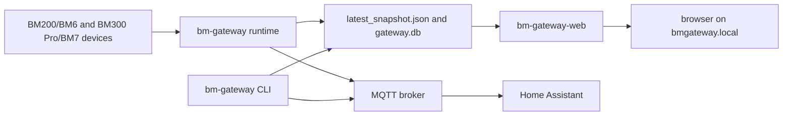
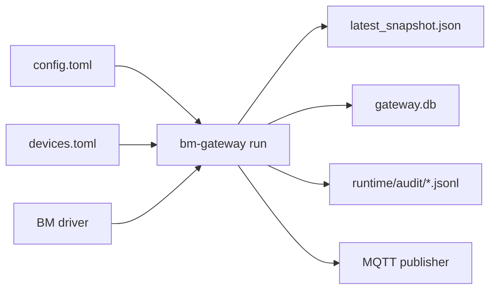
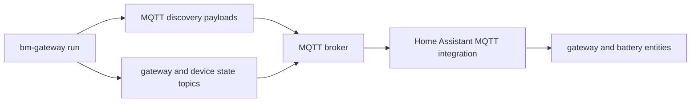
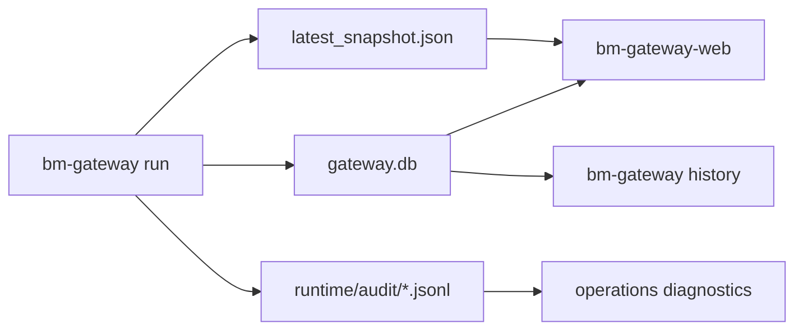

# Application Surfaces

## Contents

- [Purpose](#purpose)
- [System Flow](#system-flow)
- [Canonical Names](#canonical-names)
- [Shared Core and Runtime](#shared-core-and-runtime)
- [Command Line](#command-line)
- [Web UI](#web-ui)
- [Home Assistant and MQTT](#home-assistant-and-mqtt)
- [Persistence and Runtime State](#persistence-and-runtime-state)
- [Raspberry Pi Services](#raspberry-pi-services)
- [When To Update This Document](#when-to-update-this-document)

## Purpose

This is the canonical map of the shipped `BMGateway` application surfaces. It
fills the gap between the high-level project README and the implementation
files by naming the real runtime, command-line, web UI, Home Assistant, and
persistence boundaries.

For setup steps, use the root [README](../README.md#bmgateway). For the
architecture decision behind the split, use
[Shared core, separate runtime and web executables](architecture/2026-04-20-shared-core-separate-web-runtime-plan.md#shared-core-separate-runtime-and-web-executables).

## System Flow

This diagram shows the shipped top-level data and control flow.



The runtime owns live collection and publishing. The web executable reads the
same config, device registry, snapshot, and SQLite history, then exposes the
local management UI. The CLI is both the operator tool and the implementation
surface used by some web actions.

## Canonical Names

| Surface | Canonical name | Implementation owner |
| :-- | :-- | :-- |
| Shared Python implementation | `bm_gateway` shared core | `python/src/bm_gateway/` |
| Runtime and operator CLI | `bm-gateway` | `python/src/bm_gateway/cli.py` |
| Optional web executable | `bm-gateway-web` | `python/src/bm_gateway/web_cli.py` |
| Runtime service unit | `bm-gateway.service` | `rpi-setup/systemd/bm-gateway.service` |
| Web service unit | `bm-gateway-web.service` | `rpi-setup/systemd/bm-gateway-web.service` |
| Local web UI | web UI | `python/src/bm_gateway/web.py` and `web_pages_*.py` |
| Home Assistant integration | Home Assistant MQTT discovery | `python/src/bm_gateway/contract.py` and `mqtt.py` |
| Device configuration | device registry | `~/.config/bm-gateway/devices.toml` |
| Gateway configuration | config file | `~/.config/bm-gateway/config.toml` |
| Runtime state | runtime state | `runtime/latest_snapshot.json`, `runtime/gateway.db`, `runtime/audit/` |

Use these names in documentation unless a specific UI label or command help
text uses a different phrase.

## Shared Core and Runtime

The shared core is the Python package under `python/src/bm_gateway/`. It owns:

- config loading and validation: `config.py`
- device registry loading and validation: `device_registry.py`
- BM200/BM6 and BM300 Pro/BM7 protocol drivers: `drivers/`
- runtime polling and snapshots: `runtime.py`
- SQLite history and rollups: `state_store.py`
- audit logs: `audit_log.py`
- MQTT publishing and Home Assistant discovery payloads: `mqtt.py`,
  `contract.py`
- archive-history import and protocol diagnostics: `archive_sync.py`,
  `protocol_probe.py`, `protocol_analysis.py`, `bm300_multipage.py`
- self-healing and gateway alerts: `self_healing.py`, `system_alerts.py`,
  `bluetooth_recovery.py`

The runtime path is `bm-gateway run`. It can run once, run forever under
`bm-gateway.service`, publish Home Assistant discovery, persist snapshots, and
write SQLite history.

This diagram shows the runtime inputs and the artifacts it writes each cycle.



## Command Line

The installed command-line surfaces are:

| Command | Purpose |
| :-- | :-- |
| `bm-gateway config show` | Print resolved gateway configuration |
| `bm-gateway config validate` | Validate config and device registry |
| `bm-gateway devices list` | Inspect configured devices |
| `bm-gateway ha contract` | Render Home Assistant MQTT topics and entity expectations |
| `bm-gateway ha discovery` | Render or export Home Assistant MQTT discovery payloads |
| `bm-gateway history raw` | Show recent raw readings |
| `bm-gateway history daily` | Show daily device summaries |
| `bm-gateway history monthly` | Show monthly device summaries |
| `bm-gateway history yearly` | Show yearly device summaries |
| `bm-gateway history compare` | Show long-term degradation comparison windows |
| `bm-gateway history archive` | Show imported archive-history rows |
| `bm-gateway history sync-device` | Import supported onboard archive history |
| `bm-gateway history stats` | Show storage counts and per-device ranges |
| `bm-gateway history prune` | Apply configured retention limits |
| `bm-gateway protocol probe-history` | Run bounded live protocol probes and print JSONL |
| `bm-gateway protocol analyze-history-captures` | Analyze saved protocol probe captures offline |
| `bm-gateway protocol bm300-multipage-import` | Import validated BM300 Pro/BM7 history into a separate DB |
| `bm-gateway run` | Execute the runtime |
| `bm-gateway-web manage` | Run the local management web UI |
| `bm-gateway-web serve` | Serve HTML and JSON from a snapshot file |
| `bm-gateway-web render` | Render snapshot HTML to stdout |

Use `bm-gateway <command> --help` or `bm-gateway-web <command> --help` as the
runtime source of truth when adding options.

## Web UI

The web UI is server-rendered by `bm-gateway-web`. It is not a separate
frontend application or package. HTML comes from `python/src/bm_gateway/`
renderers, CSS and JavaScript are packaged assets, and localization catalogs
are packaged with the Python package.

Primary page routes:

| Route | User-facing surface |
| :-- | :-- |
| `/` | Home |
| `/history` | History |
| `/device?device_id=<id>` | Device Detail |
| `/devices` | Devices |
| `/devices/new` | Add Device |
| `/devices/edit?device_id=<id>` | Edit Device |
| `/settings` | Settings |
| `/diagnostics` and `/debug` | Diagnostics |
| `/frame/fleet-trend` | hidden Fleet Trend frame renderer |
| `/frame/battery-overview` | hidden Battery Overview frame renderer |

Primary JSON routes:

| Route | Purpose |
| :-- | :-- |
| `/api/status` | current snapshot plus version |
| `/api/config` | current config and device registry text |
| `/api/devices` | configured devices |
| `/api/ha/contract` | Home Assistant MQTT contract |
| `/api/ha/discovery` | Home Assistant MQTT discovery payloads |
| `/api/storage` | SQLite storage summary |
| `/api/analytics?device_id=<id>` | degradation report for one device |
| `/api/history?device_id=<id>&kind=<kind>` | raw, daily, monthly, or yearly history |
| `/api/chart-history?device_id=<id>&range=<range>&end=<timestamp>` | one chart page (`1` through `730` days); raw samples for 30-day-or-shorter all-raw windows, daily rollups for pages that cross raw expiry and for wider ranges |
| `/api/history-sync/status` | history sync progress |
| `/api/usb-otg-export/status` | USB OTG image-export progress |

State-changing routes live in `python/src/bm_gateway/web.py` and delegate to
helpers in `python/src/bm_gateway/web_actions.py`. They cover device edits,
settings edits, one-shot polling, Home Assistant discovery republish, runtime
restart, Bluetooth recovery, host reboot/shutdown, history pruning, and USB OTG
image-export actions. Notification preferences and the test-email action use
the same settings surface and the host `sendmail` transport.

The web UI settings are grouped by real config ownership:

- Gateway settings
- MQTT settings
- Home Assistant settings
- Archive sync settings
- Self-healing settings
- Bluetooth settings
- Web display and binding settings
- USB OTG image-export settings
- System-mail notification settings, including bounded offline delivery mode

## Home Assistant and MQTT

`BMGateway` integrates with Home Assistant through Home Assistant MQTT
discovery. Home Assistant does not scan the gateway web UI and does not require
a custom integration for the normal path.

This diagram shows the MQTT discovery and state path used by Home Assistant.



Use [Home Assistant setup](../home-assistant/setup.md#home-assistant-setup) for
operator steps. Use
[Home Assistant MQTT contract](../home-assistant/contract.md#home-assistant-mqtt-contract)
for exact topics, entities, and payload shapes.

## Persistence and Runtime State

The default user config lives under:

```text
~/.config/bm-gateway/
```

The default runtime state is resolved from config and contains:

| Artifact | Purpose |
| :-- | :-- |
| `runtime/latest_snapshot.json` | latest gateway and device snapshot |
| `runtime/gateway.db` | SQLite canonical samples, derived rollups, import batches, and metadata |
| `runtime/audit/YYYY-MM-DD.jsonl` | structured operational audit events |

This diagram shows how runtime state files are produced and consumed.



Raw history retention defaults to two years and applies to canonical
`device_samples`. Daily rollups are finalized from canonical samples before
raw pruning, then retained independently; they default to no extra
rollup-only pruning. A page can aggregate still-retained raw samples when its
daily row has been pruned. Audit logs are pruned automatically after 90 days.

## Raspberry Pi Services

The Raspberry Pi appliance shape uses separate service units:

| Service | Purpose |
| :-- | :-- |
| `bm-gateway.service` | runs `bm-gateway run` for collection, persistence, and MQTT |
| `bm-gateway-web.service` | runs `bm-gateway-web` for the local web UI |
| `glances-web.service` | optional Home Assistant-compatible Glances API |
| `cockpit.socket` | optional Cockpit host administration |

Use [Raspberry Pi gateway manual setup](../rpi-setup/manual-setup.md#raspberry-pi-gateway-manual-setup)
for install, service refresh, and live validation.

## When To Update This Document

Update this document when a change adds, removes, renames, or materially
changes:

- an installed executable or command group
- a runtime state artifact
- a web page, JSON route, or state-changing action group
- a service unit or Raspberry Pi operational surface
- the Home Assistant MQTT discovery or payload contract
- terminology used across user-facing documentation
