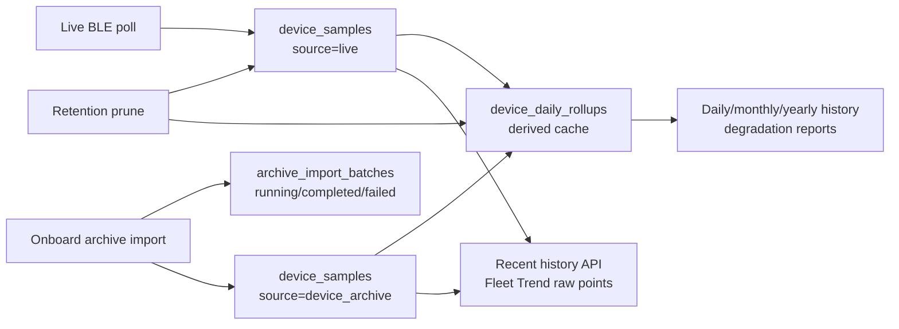

# Unified History Storage

## Contents

- [Purpose](#purpose)
- [Current Flow](#current-flow)
- [Tables](#tables)
- [Retention](#retention)
- [Import Failure Behavior](#import-failure-behavior)

## Purpose

Live samples and onboard archive imports share one canonical SQLite table:
`device_samples`. Import source is metadata on each sample, not a separate
storage path.

The goal is simple operational behavior:

- if a sample exists in the database, history and Fleet Trend can display it
- if an archive import finds a missing sample, it inserts it at its timestamp
- retention pruning is independent of the import path
- daily, monthly, yearly, and degradation views are derived from the same
  retained samples

## Current Flow

This diagram shows how live samples and archive imports share the canonical
history store.

## Tables

`device_samples` is the source of truth for battery measurements. The row key is
`device_id`, `sample_ts`, `source`, and `source_profile`, so repeated imports
are idempotent and missing archive samples can be inserted between existing
live samples.

`source` distinguishes live polling from device archive imports. Readers dedupe
samples with the same timestamp by `source_priority`, so live samples still win
over archive samples when both exist for the same device and timestamp.

`device_daily_rollups` is a derived cache rebuilt from `device_samples`. Long
range views use it for speed, but it is not an independent history source.

`archive_import_batches` records import attempts. A normal import transitions
from `running` to `completed`; a failed import is marked `failed`. If power is
lost after the batch starts but before completion, the stale `running` row is
diagnostic evidence and the next import can retry safely because sample inserts
are idempotent.

Legacy tables `device_readings` and `device_archive_readings` are kept only as
upgrade inputs. On database open, their existing rows are copied into
`device_samples`. New runtime and archive data is written only to
`device_samples`.

## Retention

Raw retention applies to `device_samples`. After old samples are removed,
`device_daily_rollups` is rebuilt from the retained samples. This keeps cleanup
separate from import and prevents stale rollup-only data from pretending that a
sample still exists.

`daily_retention_days = 0` means no extra rollup-only pruning beyond the
canonical sample retention. A positive daily retention value can still prune
the derived cache more aggressively.

## Import Failure Behavior

Archive imports do not stage data in a temporary measurement table. They insert
directly into `device_samples` inside the import transaction and use
`archive_import_batches` for audit status.

If an import fails before commit, SQLite rolls the sample changes back and the
batch is marked `failed`. If the gateway loses power before commit, the samples
from that transaction may not be present, but the next import can request the
same archive window and fill the missing rows without duplicating existing
ones.
