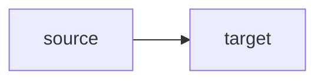

# Documentation Maintenance

## Contents

- [Purpose](#purpose)
- [Canonical Sources](#canonical-sources)
- [Documentation Modes](#documentation-modes)
- [Quick Index vs Contents](#quick-index-vs-contents)
- [Terminology](#terminology)
- [Duplication Rules](#duplication-rules)
- [Diagram Rules](#diagram-rules)
- [Update Checklist](#update-checklist)
- [Validation](#validation)
- [References](#references)

## Purpose

This guide defines how maintainers and AI agents should update `BMGateway`
documentation. Use it before creating new documentation or materially changing
existing documentation.

The goal is simple: a new reader should be able to move from project overview,
to install flow, to runtime behavior, to implementation references without
finding competing explanations for the same contract.

## Canonical Sources

Prefer one canonical source for each concept, then link to it from shorter
entry points.

| Concept | Canonical document |
| :-- | :-- |
| Project entrypoint and supported user paths | [README](../README.md#bmgateway) |
| Documentation map | [Developer Notes](README.md#developer-notes) |
| Documentation maintenance rules | [Documentation maintenance](documentation-maintenance.md#documentation-maintenance) |
| Runtime, CLI, web UI, and integration surfaces | [Application surfaces](application-surfaces.md#application-surfaces) |
| Shared-core architecture decision | [Shared core, separate runtime and web executables](architecture/2026-04-20-shared-core-separate-web-runtime-plan.md#shared-core-separate-runtime-and-web-executables) |
| Packaged Python implementation | [Python component](../python/README.md#python-component) |
| Web product boundary and UI behavior | [Web component](../web/README.md#web-component) |
| Home Assistant operator setup | [Home Assistant setup](../home-assistant/setup.md#home-assistant-setup) |
| Home Assistant MQTT topic and payload contract | [Home Assistant MQTT contract](../home-assistant/contract.md#home-assistant-mqtt-contract) |
| Raspberry Pi install and live validation | [Raspberry Pi gateway manual setup](../rpi-setup/manual-setup.md#raspberry-pi-gateway-manual-setup) |
| Hardware compatibility and service tuning | [Raspberry Pi hardware audit and service tuning](../rpi-setup/hardware-audit.md#raspberry-pi-hardware-audit-and-service-tuning) |
| Active backlog and unshipped work | [TODO](../TODO.md#todo) |

If a document needs context from another canonical source, add a short summary
and link to the canonical source instead of copying the full explanation.

## Documentation Modes

Use general documentation best practices as quality guidance, not as automatic
project truth. `BMGateway` contracts come from the repository, packaged CLIs,
service units, config schema, shipped web routes, and live validation notes.

Before expanding a document, identify the document mode:

| Mode | Use for | BMGateway examples |
| :-- | :-- | :-- |
| Tutorial | First-time path through a workflow | Raspberry Pi bootstrap path in `rpi-setup/manual-setup.md` |
| How-to guide | Task-oriented operational steps | Troubleshooting runbooks under `rpi-setup/` |
| Reference | Stable commands, config, paths, payloads, or routes | `docs/application-surfaces.md`, `home-assistant/contract.md` |
| Explanation | Architecture or design reasoning | Architecture notes under `docs/architecture/` |

Keep these modes separate when possible. Do not turn a setup guide into a full
architecture explanation when a link to the canonical explanation is enough.

## Quick Index vs Contents

Use `Quick Index` and `Contents` for different jobs.

Use `Quick Index` only on entrypoint documents whose main purpose is routing
readers to the right place:

- root `README.md`
- `docs/README.md`
- component landing pages such as `home-assistant/README.md`
- other short pages that mostly link to canonical documents

A `Quick Index` may link to headings in the same document and to other
documents. Keep each entry short and outcome-oriented.

Use `Contents` for documents whose main content lives in that same file:

- runbooks
- architecture or explanation documents
- reference documents
- long how-to guides
- any document with four or more meaningful `##` sections

A `Contents` section should mostly link to headings in the same file.

Do not use both `Quick Index` and `Contents` in the same document unless the
page is unusually large and the roles are clearly different. In that case, put
`Quick Index` first for cross-document routing and keep `Contents` limited to
local headings.

## Terminology

Use the names that appear in the code, package metadata, service units, config
schema, and web UI. When adding a recurring term, define it in the most relevant
canonical document in the same change.

Use these terms consistently:

| Use | Avoid |
| :-- | :-- |
| `BMGateway` | BM Gateway, gateway app when naming the product |
| `bm_gateway` | alternate Python package names |
| `bm-gateway` | main CLI, runtime command |
| `bm-gateway-web` | web executable |
| `bm-gateway.service` | backend service, collector service when the systemd unit is meant |
| `bm-gateway-web.service` | web service unit |
| `runtime` | daemon, worker, backend when the CLI runtime is meant |
| `shared core` | backend layer when referring to shared Python modules |
| `web UI` or `local web UI` | frontend app, dashboard when the shipped web pages are meant |
| `Home Assistant MQTT discovery` | Home Assistant auto-discovery, HA magic |
| `Home Assistant MQTT contract` | Home Assistant contract in operator setup text |
| `device registry` | devices file, battery list |
| `runtime state` | cache when referring to `latest_snapshot.json`, SQLite, or audit logs |
| `USB OTG image export` | picture-frame mode, OTG mode when the feature is meant |

Use `backend` or `frontend` only when contrasting generic application layers.
When referring to this repository, prefer the concrete names `shared core`,
`runtime`, `web executable`, and `web UI`.

## Duplication Rules

- Keep the root `README.md` concise. It should orient readers and link to
  details, not duplicate setup runbooks or route references.
- Keep `docs/README.md` as the central developer documentation index.
- Put runtime, CLI, web UI, and integration surface summaries in
  `docs/application-surfaces.md`.
- Put Python implementation details in `python/README.md`.
- Put web UI behavior, localization, chart behavior, and route families in
  `web/README.md`.
- Put Home Assistant setup steps in `home-assistant/setup.md`.
- Put exact Home Assistant MQTT topics, entities, and payload shapes in
  `home-assistant/contract.md`.
- Put Raspberry Pi installation, service refresh, and live validation steps in
  `rpi-setup/manual-setup.md`.
- Put hardware compatibility and model checks in `rpi-setup/hardware-audit.md`.
- When two docs repeat more than a short paragraph, choose one canonical owner
  and replace the other copy with a summary plus link.
- When changing a runtime, service, config, CLI, web UI, MQTT, or persistence
  contract, update the canonical documentation and changelog in the same
  change.

## Diagram Rules

Use horizontal Mermaid flowcharts for architecture and operator flows:



- Start Mermaid blocks with ` ```mermaid ` and put `flowchart LR` on the next
  line.
- Keep labels short and concrete.
- Prefer real system names: `bm-gateway`, `bm-gateway-web`, `bm_gateway`,
  `latest_snapshot.json`, `gateway.db`, `MQTT broker`, `Home Assistant`, and
  `bmgateway.local`.
- Use diagrams to clarify control paths, deployment paths, runtime data flow,
  or integration ownership.
- Do not add duplicate diagrams to every document. Add one local diagram only
  when it helps the document's task; otherwise link to
  [Application surfaces](application-surfaces.md#application-surfaces) or the
  shared-core architecture decision.

## Update Checklist

Before editing documentation:

1. Identify the canonical source for the concept.
2. Search for existing references with `rg`.
3. Decide whether the target document needs full detail, a short summary, or
   just a link.
4. Use repository terminology exactly.
5. Check whether README, docs index, changelog, or AGENTS guidance should link
   to the new or changed document.
6. Decide whether the document needs `Quick Index` or `Contents`.

After editing documentation:

1. Check for stale terminology and duplicated long explanations.
2. Check Mermaid blocks use `flowchart LR`.
3. Update `CHANGELOG.md` for user-visible documentation structure,
   architecture diagrams, runbook contract changes, or terminology changes.
4. Run markdownlint on every Markdown file edited.

## Validation

Run markdownlint with the user-wide configuration:

```bash
markdownlint --config /Users/mmassari/.markdownlint.json <changed-markdown-files>
```

If a broader lint pass reports pre-existing failures outside the files touched,
do not hide them. Mention them in the handoff and keep the current change
focused unless the task explicitly includes repository-wide Markdown cleanup.

## References

- [Diátaxis](https://diataxis.fr/) for separating tutorials, how-to guides,
  technical reference, and explanation.
- [Google developer documentation style guide](https://developers.google.com/style)
  for clear developer documentation and consistent wording.
- [Google footnotes guidance](https://developers.google.com/style/footnotes)
  for avoiding footnotes in developer documentation.
- [Google cross-reference guidance](https://developers.google.com/style/cross-references)
  for selective links with descriptive link text.
- [Microsoft table of contents guidance](https://learn.microsoft.com/en-us/style-guide/a-z-word-list-term-collections/t/table-of-contents)
  for using "Contents" rather than "Table of contents" as a heading.
