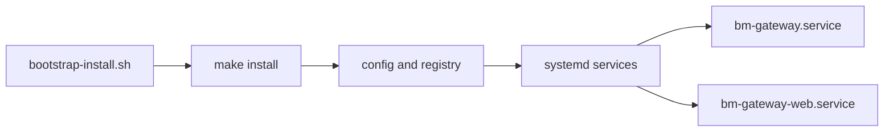

# Raspberry Pi Setup

## Quick Index

- [Purpose](#purpose)
- [Current Contents](#current-contents)
- [Installed Artifacts](#installed-artifacts)
- [Default Hostname Behavior](#default-hostname-behavior)
- [Development Deploys](#development-deploys)

## Purpose

This directory owns Raspberry Pi provisioning and operational guidance.

## Current Contents

Current contents:

- [manual-setup.md](manual-setup.md) for the current manual Raspberry Pi
  gateway setup flow
- [macos-imager-cli.md](macos-imager-cli.md) for SD-card provisioning from
  macOS with Raspberry Pi Imager CLI
- [hardware-audit.md](hardware-audit.md) for hardware validation, boot tuning,
  and service/module trimming on a headless gateway
- [troubleshooting-mdns-hostname.md](troubleshooting-mdns-hostname.md) for
  recovering the expected Bonjour or mDNS hostname after a hardware move
- [troubleshooting-bluetooth.md](troubleshooting-bluetooth.md) for recovering a
  blocked or powered-off Bluetooth controller after a hardware move
- `ansible/` for provisioning automation
- `examples/imager/` for first-boot payload examples
- `systemd/` for the runtime unit
- `systemd/glances-web.service` as the Home Assistant-compatible Glances API unit
- `scripts/` for install and update helpers
- `../scripts/bootstrap-install.sh` for one-line host bootstrap onto the Pi
- `../scripts/dev-deploy.sh` for syncing the current checkout to an existing
  development host

macOS helpers:

- `rpi-setup/scripts/macos-imager-cli.sh` for wrapping Raspberry Pi Imager CLI
- `rpi-setup/examples/imager/bm-gateway-first-run.sh` as a first-boot example

## Installed Artifacts

The install helper places these files:

- `~/.config/bm-gateway/config.toml`
- `~/.config/bm-gateway/devices.toml`
- `~/.local/bin/bm-gateway`
- `~/.local/bin/bm-gateway-web`
- `/etc/systemd/system/bm-gateway.service`
- `/etc/systemd/system/bm-gateway-web.service`
- `/usr/local/bin/bm-gateway`
- `/usr/local/bin/bm-gateway-web`

The one-line bootstrap installs the full appliance by default:

- documented Raspberry Pi OS system packages for runtime, web, Bluetooth, and
  USB OTG helper paths
- standalone CLI runtime
- runtime service
- management web service
- optional Glances API service for Home Assistant
- optional Cockpit HTTPS host administration on port `9090`
- live-ready config with an empty device registry

This diagram summarizes the bootstrap artifacts installed on the Raspberry Pi.



## Default Hostname Behavior

- the documented default Raspberry Pi hostname is `bmgateway`
- the default Bonjour/mDNS address is `bmgateway.local`
- if you want a different `.local` name, use the hostname override documented
  in [manual-setup.md](manual-setup.md)
- after an SD-card move, rerun the bootstrap or use the troubleshooting
  runbooks above to clear stale Bluetooth `rfkill` state and refresh Avahi

## Development Deploys

For repeat development deploys to an already bootstrapped host, use:

```bash
make dev-deploy TARGET=admin@host
```

Stabilize the manual setup first, then translate it into Ansible.
